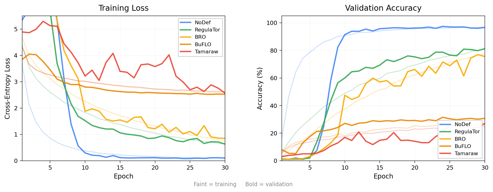

# Deep Fingerprinting — CCS'18 Reproduction

Reproduction and evaluation of the Deep Fingerprinting (DF) attack from:

> Sirinam et al. **"Deep Fingerprinting: Undermining Website Fingerprinting Defenses with Deep Learning."** CCS '18. https://doi.org/10.1145/3243734.3243768

We reproduce the paper's results on curated benchmark data, collect our own Tor traffic, and evaluate the impact of traffic analysis defenses on independently gathered traces.

---

## Key Results

### Benchmark Data (closed-world, 100 classes)

| Defense | Test Accuracy | Paper |
|---------|-------------:|------:|
| NoDef | **96.1%** | ~98% |
| WTF-PAD | **89.5%** | — |
| RegulaTor | **81.8%** | — |
| BRO | **74.1%** | — |
| WalkieTalkie | **46.1%** (top-1) / **73.7%** (top-2) | — |
| BuFLO | **31.7%** | — |
| Tamaraw | **26.1%** | — |

### Self-Collected Data (closed-world, 95 classes, March 2026)

| Dataset | Test Accuracy |
|---------|-------------:|
| NoDef (cell-level) | **48.0%** |
| Tamaraw-defended | **9.6%** |

Cross-dataset generalization (train on one, test on the other) consistently yields ~1% accuracy — random chance — confirming the DF model learns environment-specific patterns rather than universal fingerprints.

---

## Model Architecture

DFNet is a 1D CNN trained on direction-only sequences (+1 outgoing, −1 incoming, 0 padding), fixed length 5,000.

- 4 Conv1D blocks: 32 → 64 → 128 → 256 filters, kernel size 8, ELU (block 1) / ReLU (blocks 2–4)
- BatchNorm + MaxPool + Dropout (0.1) per block
- 2 FC layers: 512 units each, Dropout 0.7 / 0.5
- Softmax output
- Optimizer: Adamax (lr=0.002), batch size 128, 30 epochs

---

## Setup

```bash
python -m venv .venv
source .venv/bin/activate
pip install -r requirements.txt
```

Requires Python 3.10+, TensorFlow 2.15+, CUDA-capable GPU recommended.

---

## Datasets

### Benchmark Pickles

Pre-processed DF-format pickles for 7 defense configurations. Place them as:

```
dataset/
  ClosedWorld/
    NoDef/         # X_train_NoDef.pkl, y_train_NoDef.pkl, X_valid_*, y_valid_*, X_test_*, y_test_*
    WTFPAD/
    RegulaTor/
    BRO/
    BuFLO/
    Tamaraw/
    WalkieTalkie/
  OpenWorld/
    NoDef/
    RegulaTor/
    BRO/
    BuFLO/
    Tamaraw/
```

Each `X_*.pkl` has shape `(n, 5000)` with values in `{−1, 0, +1}`. Each `y_*.pkl` has shape `(n,)` with integer class labels.

### Self-Collected Dataset

We crawled Tor traffic for the Alexa Top-100 sites from two machines:
- **Local** (WSL2, RTX 3080): 15 parallel Tor instances
- **GCP** (e2-standard-16, us-central1): 30 parallel Tor instances

Raw pcaps (91,955 files) were reprocessed to approximate Tor cell-level sequences: for each TCP packet with non-zero payload to/from the guard IP, emit `ceil(payload_bytes / 512)` direction events. See `scripts/reprocess_cell_level.py`.

Final dataset: **90,338 traces, 95 classes**, split 80/10/10.

---

## Usage

### Train on benchmark (closed-world)

```bash
cd src
python train_closed_world.py --defense NoDef
python train_closed_world.py --defense Tamaraw
python train_closed_world.py --defense WTFPAD --epochs 40
python train_closed_world.py --defense WalkieTalkie --top_n 2
```

### Train on benchmark (open-world)

```bash
python train_open_world.py --defense NoDef
python train_open_world.py --defense Tamaraw
```

### Train on self-collected data

```bash
# After running scripts/reprocess_cell_level.py to produce pickles in /path/to/cell-level/
python src/train_combined.py --data_dir /path/to/cell-level --epochs 50
```

### Apply Tamaraw defense to self-collected data and evaluate

```bash
python scripts/defend_and_eval.py
```

### Generate defense training curves figure

```bash
# Train all defenses and save per-epoch histories (runs ~15 min on GPU):
python scripts/plot_defense_curves.py

# Regenerate figure from saved CSVs only:
python scripts/plot_defense_curves.py --plot-only
```

### Test without real data

```bash
python train_closed_world.py --synthetic --epochs 5
python train_open_world.py --synthetic --epochs 5
```

---

## Figures

| Figure | Description |
|--------|-------------|
| `experiments/fig_defense_training_curves.png` | Training loss + validation accuracy curves for all 5 benchmark defenses |
| `experiments/fig_closed_world_accuracy_ours_vs_modern.png` | Bar chart: benchmark vs self-collected closed-world accuracy |
| `experiments/fig_training_curve_crawled95.png` | Accuracy over epochs for 95-class self-collected data |
| `experiments/fig_loss_curve_crawled95.png` | Loss over epochs for 95-class self-collected data |



---

## Project Structure

```
src/
  model.py                      # DFNet architecture
  data_utils.py                 # Data loading and preprocessing
  train_closed_world.py         # Closed-world train + eval
  train_open_world.py           # Open-world train + eval
  train_combined.py             # Train on self-collected combined dataset
  combine_datasets.py           # Combine raw pcaps into DF-format pickles
  evaluate.py                   # Metrics and plotting utilities
scripts/
  reprocess_cell_level.py       # Reprocess pcaps to cell-level sequences (the key fix)
  defend_and_eval.py            # Apply Tamaraw simulation to self-collected data
  plot_defense_curves.py        # Generate training curve figures
  filter_resplit_combined.py    # Filter, cap, and stratified-split datasets
  cross_dataset_eval.py         # Benchmark → crawled cross-dataset evaluation
  cross_dataset_eval_reverse.py # Crawled → benchmark cross-dataset evaluation
crawler/
  crawl.py                      # Single-worker Tor crawler
  crawl_parallel.py             # Multi-worker parallel crawler
  capture.py                    # pcap capture and sequence extraction
dataset/                        # Benchmark pickle files (not committed)
experiments/                    # Results, figures, and per-epoch history CSVs
```

---

## Detailed Findings

See [`experiments/06_full_reproduction_summary.md`](experiments/06_full_reproduction_summary.md) for a full write-up covering:
- The packet-level vs. cell-level representation bug we discovered (affected all 3 independent crawlers)
- Cross-dataset generalization experiments
- Analysis of why the 48pp accuracy gap between benchmark and self-collected data persists
- Paper-ready dataset and methodology description

---

## Reference

```bibtex
@inproceedings{sirinam2018deep,
  title={Deep Fingerprinting: Undermining Website Fingerprinting Defenses with Deep Learning},
  author={Sirinam, Payap and Imani, Mohsen and Juarez, Marc and Wright, Matthew},
  booktitle={Proceedings of the 2018 ACM SIGSAC Conference on Computer and Communications Security},
  pages={1928--1943},
  year={2018},
  organization={ACM}
}
```
