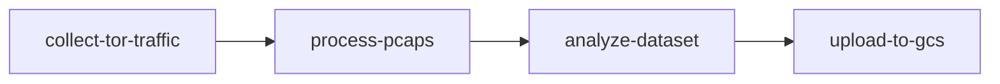

# Infrastructure as Code (IaaS) for Website Fingerprinting Data Collection

This directory contains complete infrastructure automation for the CS244C Website Fingerprinting (WF) data collection project. It automates the deployment of a Google Kubernetes Engine (GKE) cluster, storage resources, and Argo Workflows pipeline to orchestrate the data collection, processing, and analysis tasks.

## 🏗️ Architecture Overview

```
┌─────────────────────────────────────────────────────────────────┐
│                     Google Cloud Platform                       │
├─────────────────────────────────────────────────────────────────┤
│  ┌─────────────────┐  ┌─────────────────┐  ┌─────────────────┐ │
│  │   GKE Cluster   │  │   GCS Bucket    │  │ Persistent Disks│ │
│  │                 │  │                 │  │                 │ │
│  │ ┌─────────────┐ │  │ ┌─────────────┐ │  │ ┌─────────────┐ │ │
│  │ │Argo         │ │  │ │  pcap/      │ │  │ │ 500GB HDD   │ │ │
│  │ │Workflows    │ │  │ │  pickle/    │ │  │ │ (pcap data) │ │ │
│  │ │Controller   │ │  │ │  analysis/  │ │  │ └─────────────┘ │ │
│  │ └─────────────┘ │  │ │  logs/      │ │  │ ┌─────────────┐ │ │
│  │                 │  │ └─────────────┘ │  │ │ 100GB SSD   │ │ │
│  │ ┌─────────────┐ │  └─────────────────┘  │ │(processed   │ │ │
│  │ │Data         │ │                       │ │ data)       │ │ │
│  │ │Collection   │ │                       │ └─────────────┘ │ │
│  │ │Pods         │ │                       └─────────────────┘ │
│  │ └─────────────┘ │                                           │
│  └─────────────────┘                                           │
└─────────────────────────────────────────────────────────────────┘

Pipeline Flow:
collect.py → process.py → analyze.py → GCS Upload
```

## 📁 Directory Structure

```
iaas/
├── README.md                          # This file
├── terraform/                         # Infrastructure as Code
│   ├── main.tf                       # GKE cluster and networking
│   ├── storage.tf                    # Storage resources (GCS, disks)
│   ├── variables.tf                  # Configurable parameters
│   ├── outputs.tf                    # Infrastructure outputs
│   └── terraform.tfvars.example      # Example configuration
├── docker/                           # Container configuration
│   ├── Dockerfile                    # WF data collection container
│   └── build.sh                      # Docker build and push script
├── k8s-manifests/                    # Kubernetes resources
│   ├── storage.yaml                  # Persistent volumes and config
│   └── rbac.yaml                     # Service accounts and permissions
├── argo-workflows/                   # Workflow automation
│   ├── install-argo.yaml            # Argo Workflows installation
│   └── wf-data-pipeline.yaml        # Data collection pipeline
└── scripts/                         # Deployment automation
    ├── deploy.sh                     # Main deployment script
    └── run-workflow.sh               # Workflow execution helper
```

## 🎯 Why This Infrastructure?

### 1. **Scalability & Resource Management**
   - **Problem**: The original setup required manual VM provisioning and could only run one collection at a time
   - **Solution**: GKE provides auto-scaling node pools that can dynamically provision resources based on workload demand
   - **Benefit**: Multiple data collection tasks can run concurrently, and resources are automatically cleaned up after completion

### 2. **Reproducibility & Consistency**
   - **Problem**: Manual setup via `setup.sh` could lead to environment drift and inconsistent results
   - **Solution**: Docker containers ensure identical environments across all execution instances
   - **Benefit**: Every data collection run happens in an identical, isolated environment

### 3. **Automation & Orchestration**
   - **Problem**: The three-step process (collect → process → analyze) required manual intervention between steps
   - **Solution**: Argo Workflows orchestrates the entire pipeline automatically with proper dependency management
   - **Benefit**: Fully automated end-to-end data collection with error handling and retry logic

### 4. **Storage & Durability**
   - **Problem**: Data stored on individual VMs could be lost and wasn't easily accessible for analysis
   - **Solution**: Persistent volumes for temporary storage + GCS for long-term, accessible storage
   - **Benefit**: Data is safely stored, versioned, and accessible from anywhere for further analysis

### 5. **Cost Optimization**
   - **Problem**: Keeping VMs running 24/7 even when not collecting data
   - **Solution**: Kubernetes jobs that spin up only when needed, with preemptible nodes for cost savings
   - **Benefit**: Pay only for compute time during actual data collection

### 6. **Monitoring & Observability**
   - **Problem**: Limited visibility into collection progress and failures
   - **Solution**: Argo UI provides real-time workflow monitoring, logs, and status tracking
   - **Benefit**: Easy debugging and progress monitoring through web interface

## 🚀 Quick Start

### Prerequisites

Install required tools:
```bash
# Google Cloud SDK
curl https://sdk.cloud.google.com | bash
exec -l $SHELL

# kubectl
gcloud components install kubectl

# Terraform
wget https://releases.hashicorp.com/terraform/1.6.0/terraform_1.6.0_linux_amd64.zip
unzip terraform_1.6.0_linux_amd64.zip
sudo mv terraform /usr/local/bin/

# Docker
curl -fsSL https://get.docker.com -o get-docker.sh
sh get-docker.sh

# Argo CLI (for workflow management)
curl -sLO https://github.com/argoproj/argo-workflows/releases/latest/download/argo-linux-amd64.gz
gunzip argo-linux-amd64.gz
chmod +x argo-linux-amd64
sudo mv argo-linux-amd64 /usr/local/bin/argo
```

### 1. Configure GCP Project

```bash
# Set your GCP project
gcloud config set project YOUR_PROJECT_ID
gcloud auth login
gcloud auth application-default login --scopes=https://www.googleapis.com/auth/cloud-platform

# Enable required APIs (done automatically by Terraform)
gcloud services enable container.googleapis.com
gcloud services enable compute.googleapis.com
gcloud services enable storage.googleapis.com
```

### 2. Configure Infrastructure

```bash
cd iaas/terraform
cp terraform.tfvars.example terraform.tfvars
# Edit terraform.tfvars with your project ID
```

### 3. Deploy Everything

```bash
cd iaas/scripts
./deploy.sh
```

This single command will:
1. ✅ Initialize Terraform
2. ✅ Deploy GKE cluster with auto-scaling nodes
3. ✅ Create GCS bucket for data storage
4. ✅ Set up persistent volumes for temporary storage
5. ✅ Configure Workload Identity for secure GCS access
6. ✅ Install Argo Workflows with UI
7. ✅ Build and push Docker container to GCR
8. ✅ Deploy workflow templates

### 4. Run Data Collection

```bash
# Submit a workflow for 10 instances per site (quick test)
./run-workflow.sh submit --instances 10

# Submit full collection (90 instances per site)
./run-workflow.sh submit --instances 90

# Monitor progress
./run-workflow.sh list
./run-workflow.sh status -n <workflow-name>
./run-workflow.sh logs -n <workflow-name>

# Access Argo UI
./run-workflow.sh ui
```

## 📊 Infrastructure Components Explained

### Terraform Configuration (`terraform/`)

#### **`main.tf` - Core Infrastructure**
- **GKE Cluster**: Creates a regional cluster with auto-scaling capabilities
- **VPC Network**: Isolated network with secondary IP ranges for pods and services
- **Node Pool**: Auto-scaling worker nodes (1-5 nodes, e2-standard-4 instances)
- **Service Accounts**: Separate accounts for nodes and Workload Identity
- **IAM Bindings**: Minimal required permissions for security

**Why these choices:**
- Regional cluster for high availability
- Auto-scaling reduces costs when not in use
- Workload Identity provides secure, keyless authentication to GCS
- Separate service accounts follow principle of least privilege

#### **`storage.tf` - Data Storage**
- **GCS Bucket**: Versioned storage with lifecycle management
- **Persistent Disks**: 
  - 500GB Standard HDD for pcap files (cost-effective for large files)
  - 100GB SSD for processed data (fast access for analysis)

**Why this approach:**
- GCS provides durable, accessible storage for long-term data retention
- Lifecycle policies automatically clean up old versions to manage costs
- Different disk types optimize for use case (capacity vs speed)

### Docker Configuration (`docker/`)

#### **`Dockerfile` - Containerized Environment**
- **Base**: Ubuntu 22.04 for compatibility with original setup
- **Dependencies**: All requirements from `setup.sh` automated
- **Security**: Non-root user for container security
- **Tor Configuration**: Pre-configured with collection settings

**Why containerization:**
- Eliminates environment drift between executions
- Enables horizontal scaling across multiple nodes
- Simplifies dependency management
- Provides consistent results regardless of host system

### Kubernetes Manifests (`k8s-manifests/`)

#### **`storage.yaml` - Persistent Storage**
- **Storage Classes**: Different performance tiers for different data types
- **Persistent Volumes**: Pre-created volumes for predictable performance
- **ConfigMaps**: Environment configuration for containers

**Design decisions:**
- Pre-allocated volumes avoid provisioning delays during data collection
- Multiple storage classes optimize cost vs performance
- ConfigMaps centralize configuration management

#### **`rbac.yaml` - Security & Permissions**
- **Service Accounts**: Separate identities for different components
- **RBAC Rules**: Minimal permissions for each service
- **Workload Identity**: Secure GCS access without storing keys

**Security approach:**
- Principle of least privilege for all components
- No long-lived keys stored in cluster
- Workload Identity provides transparent GCP authentication

### Argo Workflows (`argo-workflows/`)

#### **`wf-data-pipeline.yaml` - Data Collection Orchestration**



Each step:
1. **collect-tor-traffic**: Runs `collect.py` with Tor and tcpdump
2. **process-pcaps**: Converts pcaps to direction sequences (`process.py`)
3. **analyze-dataset**: Generates analysis visualizations (`analyze.py`)
4. **upload-to-gcs**: Stores all results in GCS for long-term access

**Why Argo Workflows:**
- Kubernetes-native pipeline orchestration
- Built-in retry logic and error handling
- DAG-based dependencies ensure correct execution order
- Web UI provides real-time monitoring and debugging
- GitOps-friendly workflow definitions

## 🔧 Configuration Options

### Terraform Variables (`terraform/variables.tf`)

| Variable | Default | Purpose |
|----------|---------|---------|
| `project_id` | Required | Your GCP project ID |
| `region` | us-central1 | GCP region for resources |
| `machine_type` | e2-standard-4 | Node instance type |
| `min_node_count` | 1 | Minimum nodes (cost optimization) |
| `max_node_count` | 5 | Maximum nodes (burst capacity) |
| `disk_size_gb` | 100 | Node disk size |

### Workflow Parameters

| Parameter | Default | Description |
|-----------|---------|-------------|
| `instances` | 90 | Traces per website |
| `interface` | eth0 | Network interface for tcpdump |
| `image` | Auto-generated | Container image to use |
| `gcs-bucket` | Auto-generated | Storage bucket name |

## 🛠️ Troubleshooting

### Common Issues

**1. Terraform Authentication Issues**
```bash
# Re-authenticate
gcloud auth application-default login
gcloud config set project YOUR_PROJECT_ID
```

**2. Docker Build Failures**
```bash
# Ensure Docker daemon is running
sudo systemctl start docker
# Re-authenticate for GCR
gcloud auth configure-docker
```

**3. Workflow Failures**
```bash
# Check workflow status
./run-workflow.sh status -n <workflow-name>
# Get detailed logs
./run-workflow.sh logs -n <workflow-name>
# Check pod events
kubectl get events -n argo --sort-by='.lastTimestamp'
```

**4. Storage Issues**
```bash
# Check PV status
kubectl get pv,pvc
# Verify GCS bucket access
gsutil ls gs://your-bucket-name
```

### Debugging Workflows

1. **Check Argo UI**: Access at LoadBalancer IP or port-forward
2. **Pod Logs**: Use `kubectl logs` for detailed container output
3. **Events**: Check Kubernetes events for scheduling issues
4. **Resources**: Verify sufficient CPU/memory quotas

## 🎯 Optimization Tips

### Cost Optimization
- Use preemptible nodes for non-critical workloads
- Enable cluster autoscaler to minimize idle resources
- Set appropriate GCS lifecycle policies
- Monitor resource usage with GCP monitoring

### Performance Optimization
- Use SSD persistent disks for I/O intensive operations
- Scale node pools based on collection requirements
- Optimize container resource requests/limits
- Use regional persistent disks for high availability

### Security Best Practices
- Regularly rotate service account keys
- Enable GKE network policies
- Use Binary Authorization for container security
- Implement Pod Security Standards
- Regular security scanning of container images

## 📈 Monitoring & Observability

### Built-in Monitoring
- **Argo UI**: Workflow progress and logs
- **GKE Monitoring**: Cluster health and resource usage
- **GCS Metrics**: Storage usage and access patterns

### Additional Monitoring (Optional)
```bash
# Enable GKE Workload Identity
# Deploy Prometheus for detailed metrics
# Set up Grafana dashboards for visualization
```

## 🔄 Maintenance

### Regular Tasks
- Update container base images for security patches
- Rotate service account credentials
- Clean up old workflow runs
- Review and optimize resource allocations
- Update Terraform providers and modules

### Scaling Considerations
- Monitor node pool utilization
- Adjust min/max node counts based on usage patterns
- Consider regional clusters for high availability
- Plan storage growth and implement archival policies

## 🎊 Success Metrics

After deployment, you should have:
- ✅ Fully automated data collection pipeline
- ✅ Scalable infrastructure that handles concurrent jobs
- ✅ Persistent storage for large datasets
- ✅ Web UI for monitoring and debugging
- ✅ Cost-optimized resource usage
- ✅ Reproducible, containerized environments
- ✅ Secure, keyless authentication to cloud services

## 🤝 Contributing

To extend or modify this infrastructure:
1. Make changes to appropriate Terraform/Kubernetes configs
2. Test changes in a development project
3. Update documentation for new features
4. Submit pull requests with clear descriptions

## 📚 Additional Resources

- [GKE Documentation](https://cloud.google.com/kubernetes-engine/docs)
- [Argo Workflows Documentation](https://argoproj.github.io/argo-workflows/)
- [Terraform GCP Provider](https://registry.terraform.io/providers/hashicorp/google/latest/docs)
- [Kubernetes Documentation](https://kubernetes.io/docs/)

---

This infrastructure automates the entire Website Fingerprinting data collection pipeline, transforming a manual, single-instance process into a scalable, reliable, cloud-native solution. The investment in infrastructure pays dividends through improved reproducibility, reduced manual effort, and better resource utilization.